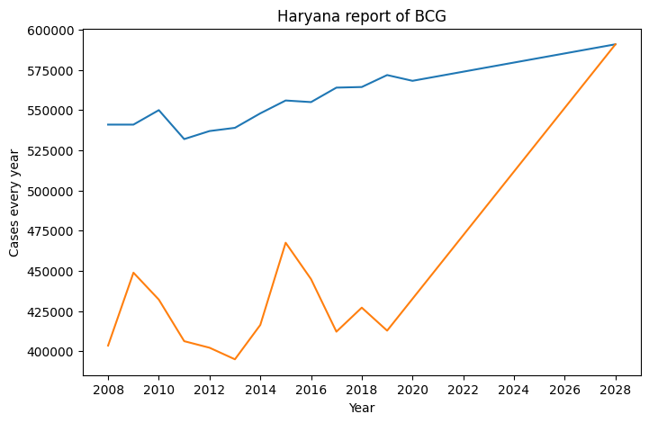

# Vaccine Procurement Predictor

## About

Our  software is going to analyze the past records and trends of  these diseases in 
various states of our nation and accurately predict the amount vaccines that need to be procured 
and the extent of vaccination that needs to be done so that such a situation may never arise again 
and each and every patient gets the treatment they deserve. 

## HMIS

- Health Management Information System (HMIS) is a Government to Government (G2G) web-based 
Monitoring Information System that has been put in place by Ministry of Health & Family Welfare (MoHFW), 
Government of India to monitor the National Health Mission and other Health programmes and 
provide key inputs for policy formulation and appropriate programme interventions.

- The analytical reports generated through HMIS also provides gap analysis and evidence based 
course correction.

## Web Scraper

The [web scraper](./Web%20Scraper/scraper.py) module scrapes HMIS to download yearly reports Indicator wise and then compiles them together into one [CSV file](./Web%20Scraper/compiled_report.csv) for the [Linear Regression Model](./VPP.ipynb) to analyze.

## Linear Regression Model

Using the data that we have scraped from HMIS, we have trained our AI model via Supervised Machine Learning
in order to accurately predict year-wise requirement of the vaccine stock that needs to be procured 
to meet the future needs and reach the goal by a certain year. The model also generates informative graph to represent the predictions.

